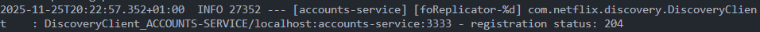
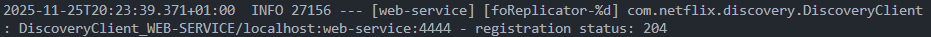
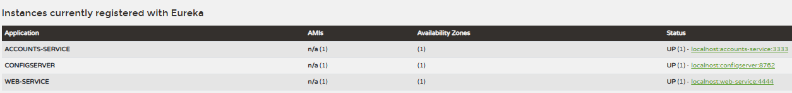
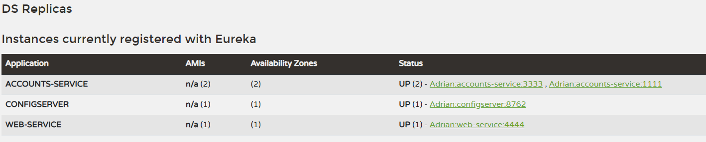
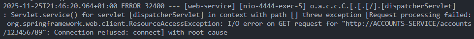
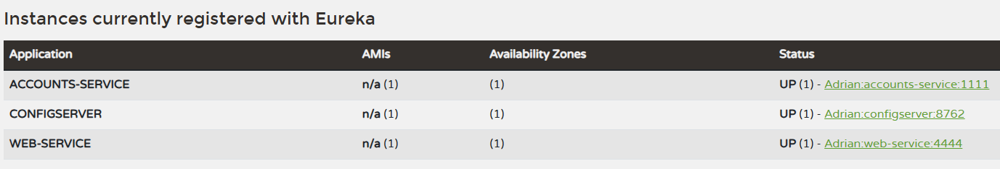
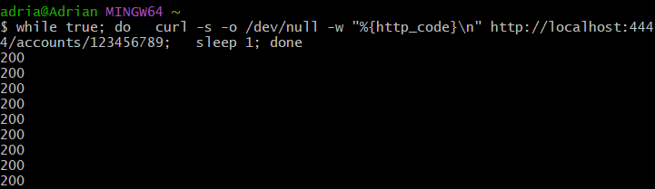

# Lab 6 Microservices - Project Report

## 1. Configuration Setup

**Configuration Repository**: [Link to your forked repository]

Describe the changes you made to the configuration:

- What did you modify in `accounts-service.yml`?
  En el fichero `accounts-service.yml`, modifiqué el puerto del servicio a `1111` para evitar conflictos con otros servicios que podrían estar ejecutándose en el puerto predeterminado.
- Why is externalized configuration useful in microservices?
  En una arquitectura de microservicios, la configuración externalizada permite:

- Cambiar parámetros (URLs, puertos, timeouts, flags como self-preservation, etc.) **sin recompilar ni desplegar** de nuevo el código.
- Gestionar **entornos distintos** (desarrollo, preproducción, producción) desde un repositorio central.
- Mantener el código más limpio y genérico, mientras que los detalles de despliegue y de infraestructura se controlan desde fuera.
- Aplicar cambios globales (por ejemplo, apuntar todos los servicios a otro servidor Eureka) de forma centralizada y coherente.

---

## 2. Service Registration (Task 1)

### Accounts Service Registration



Durante el arranque del **accounts-service**, el servicio lee su configuración externalizada, obtiene la URL del servidor Eureka y se registra en él.  
En los logs se puede ver cómo:

1. El servicio arranca en su puerto configurado.
2. Inicializa el cliente de Eureka.
3. Envía un **registro inicial** (`register`) de sus metadatos (host, puerto, `instanceId`, nombre lógico `ACCOUNTS-SERVICE`, etc.).
4. A partir de ese momento comienza a enviar **heartbeats periódicos** para indicar que sigue vivo.

Cuando el registro se completa, el servicio aparece en el panel de Eureka como una instancia `UP` de `ACCOUNTS-SERVICE`.

### Web Service Registration



El **web-service** sigue un proceso similar:

1. Arranca, lee su configuración y se registra en Eureka con su propio nombre lógico (`WEB-SERVICE`).
2. Para descubrir el accounts-service, **no usa una URL fija**, sino el nombre lógico `ACCOUNTS-SERVICE`.
3. El cliente de Eureka en el web-service:
   - Pide a Eureka la lista de instancias de `ACCOUNTS-SERVICE`.
   - Mantiene esta información en caché y la va refrescando periódicamente.
4. Cuando el web-service necesita llamar a cuentas (por ejemplo, `/accounts/123456789`), selecciona una de las instancias disponibles de `ACCOUNTS-SERVICE` y le envía la petición.

---

## 3. Eureka Dashboard (Task 2)



Describe what the Eureka dashboard shows:

- Which services are registered?
- What information does Eureka track for each instance?

---

## 4. Multiple Instances (Task 4)



Answer the following questions:

- What happens when you start a second instance of the accounts service?

  Al arrancar la segunda instancia de **ACCOUNTS-SERVICE** en el puerto `1111`, ambas instancias se registran en Eureka bajo el mismo nombre lógico de servicio.  
  En el panel de _“Instances currently registered with Eureka”_ aparece `ACCOUNTS-SERVICE` con `UP (2)` y se muestran las dos entradas:

- `localhost:accounts-service:3333`
- `Adrian:accounts-service:1111` (según el hostname de la máquina)

Eureka detecta que ahora hay **dos procesos distintos** ofreciendo el mismo servicio lógico y los agrupa bajo `ACCOUNTS-SERVICE`.

- How does Eureka handle multiple instances?

  Eureka no las trata como servicios diferentes, sino como **múltiples instancias del mismo servicio lógico**. Mantiene una lista de instancias para el identificador `ACCOUNTS-SERVICE`, cada una con su propio `host:port` y `instanceId`.
  Los clientes no llaman a una URL concreta, sino al **nombre de servicio**. Cuando preguntan a Eureka por `ACCOUNTS-SERVICE`, reciben la lista con todas las instancias disponibles. De esta manera, el sistema puede escalar añadiendo nuevas instancias sin cambiar la configuración del cliente.

- How does client-side load balancing work with multiple instances?

El web-service utiliza un patrón de **client-side load balancing**:

1. Eureka devuelve al cliente la lista de instancias activas de `ACCOUNTS-SERVICE`.
2. El cliente (Spring Cloud LoadBalancer) mantiene esa lista en memoria.
3. Para cada petición, el cliente elige una instancia según una estrategia (en este caso, **round-robin**).
4. Las peticiones se distribuyen de forma alterna entre las instancias en `3333` y `1111`.

Si una instancia deja de enviar _heartbeats_ y es eliminada del registro, el cliente dejará de recibirla en la lista y el tráfico se redirige solo a las instancias sanas.

---

## 5. Service Failure Analysis (Task 5)

### Initial Failure



Para esta tarea se arrancaron dos instancias de `ACCOUNTS-SERVICE`:

- Una en el puerto 3333.
- Otra en el puerto 1111.

El web-service se configuró para hacer peticiones a un endpoint que realmente llama a `ACCOUNTS-SERVICE`, por ejemplo:

```bash
http://localhost:4444/accounts/123456789
```

A continuación, se detuvo la instancia que estaba escuchando en el puerto 3333 usando `Ctrl + C`.

**¿Qué ocurre inmediatamente después de parar el servicio en 3333?**

Justo después de parar esta instancia, Eureka todavía la considera registrada y en estado `UP`, porque su lease todavía no ha expirado. El web-service continúa haciendo balanceo de carga entre las dos instancias conocidas (3333 y 1111), de modo que:

- Cuando la petición se enruta a la instancia en el puerto 1111, la respuesta es correcta (código 200).
- Cuando la petición se enruta a la instancia en el puerto 3333, que ya está caída, se produce un error (código 5xx o "connection refused").

Esto provoca que, durante unos instantes, las peticiones alternen entre respuestas 200 y 500, dependiendo de la instancia que seleccione el balanceador.

### Eureka Instance Removal



En la configuración original del servidor Eureka, el modo de self-preservation estaba activado. Esto hacía que, aunque la instancia en el puerto 3333 dejara de enviar heartbeats, Eureka no llegara a eliminarla del registro y el sistema no terminara de recuperarse: las respuestas 200/500 se seguían alternando de forma indefinida.

Para poder observar el comportamiento descrito en el enunciado, se modificó la configuración del discovery añadiendo:

```yaml
eureka:
  server:
    enable-self-preservation: false
```

Tras desactivar el self-preservation y repetir la prueba:

- Cuando se detiene la instancia del puerto 3333, Eureka deja de recibir sus heartbeats.
- Una vez que se supera el tiempo de expiración del lease y se ejecuta el ciclo de eviction, la instancia se marca como expirada y se elimina del registro.
- El dashboard pasa de mostrar `ACCOUNTS-SERVICE UP (2)` a mostrar `UP (1)`, quedándose únicamente la instancia en el puerto 1111.

**¿Cuánto tardó Eureka en eliminar la instancia muerta?**

Con la configuración utilizada (duración del lease y intervalo de eviction), la eliminación de la instancia de 3333 se produjo en el orden de unos 10–15 segundos desde que se detuvo el servicio, momento a partir del cual el dashboard ya solo mostraba la instancia en 1111.

**¿Qué mecanismo utiliza Eureka para detectar fallos?**

Eureka utiliza un sistema de leases y heartbeats:

- Cada instancia que se registra en Eureka obtiene un lease y debe renovarlo periódicamente enviando heartbeats.
- Si una instancia deja de renovar su lease antes de que pase el tiempo configurado (`lease-expiration-duration-in-seconds`), se considera que esa instancia ha fallado.
- Periódicamente, el servidor ejecuta el proceso de eviction, que revisa las instancias con el lease expirado y las elimina del registro (si el modo self-preservation lo permite).

Gracias a este mecanismo, Eureka es capaz de detectar qué instancias han dejado de estar disponibles y, tras eliminarlas del registro, permite que los clientes dejen de enviarles tráfico.

---

## 6. Service Recovery Analysis (Task 6)



Answer the following questions:

- Why does the web service eventually recover?

  El web service se recupera porque, una vez que Eureka elimina la instancia muerta del puerto 3333, el cliente de Eureka que utiliza `WEB-SERVICE` deja de recibir esa instancia en la lista de servidores disponibles. Cuando se refresca la lista, solo queda la instancia en el puerto 1111 y el balanceador de carga ya no puede seleccionar la instancia caída. A partir de ese momento, todas las peticiones se enrutan a la instancia sana y las respuestas vuelven a ser correctas (códigos 200) de forma estable.

- How long did recovery take?

  El tiempo de recuperación depende de dos factores: el tiempo que tarda en expirar el lease de la instancia muerta y el intervalo de eviction de Eureka, más el tiempo que tarda el cliente en refrescar su caché. En mi caso, con los valores de configuración utilizados, la eliminación de la instancia de 3333 hasta que en el dashboard apareció solo la instancia en el puerto 1111 fue de unos pocos minutos.

- What role does client-side caching play in the recovery process?

  El cliente de Eureka no consulta al servidor de descubrimiento en cada petición, sino que mantiene una caché local con la lista de instancias de cada servicio. Esta caché se actualiza de forma periódica. Esto tiene dos efectos:

  1. Reduce la carga sobre el servidor Eureka, ya que no se realizan consultas constantes.
  2. Introduce un pequeño desfase entre el momento en que Eureka elimina la instancia caída y el momento en que el cliente deja de usarla.

     Durante ese intervalo, el cliente puede seguir intentando utilizar la instancia de 3333 aunque ya no exista, produciendo todavía algunos errores. Cuando la caché se actualiza, la lista pasa a contener solo la instancia de 1111 y el sistema termina de recuperarse por completo.

---

## 7. Conclusions

En este laboratorio he podido aplicar varios conceptos importantes de arquitecturas de microservicios:

- **Microservices architecture**

  He visto cómo una aplicación se divide en servicios independientes (por ejemplo, `accounts-service` y `web-service`), cada uno con su propio ciclo de vida, configuración y despliegue. Esto permite escalar y evolucionar cada parte del sistema de forma más flexible que en una arquitectura monolítica.

- **Service discovery with Eureka**

  He aprendido cómo funciona un servidor de descubrimiento como Eureka: los servicios se registran con un nombre lógico, envían heartbeats para indicar que están vivos y otros servicios los descubren utilizando ese nombre en lugar de una dirección fija. También he entendido cómo se gestionan múltiples instancias de un mismo servicio y cómo se muestran en el dashboard.

- **System resilience and self-healing**

  El uso de múltiples instancias de un mismo servicio junto con balanceo de carga en el lado cliente hace que el sistema sea más resiliente: si una instancia falla, las demás pueden seguir atendiendo peticiones. Además, cuando Eureka elimina las instancias muertas del registro, el sistema tiende a “auto-curarse”, ya que los clientes dejan de usarlas y el tráfico se redirige a las instancias sanas.

- **Challenges you encountered and how you solved them**

  El principal reto fue que, con la configuración original, la instancia caída no se llegaba a eliminar del registro de Eureka debido al modo _self-preservation_, por lo que el sistema no terminaba de recuperarse y se mantenía la alternancia de respuestas 200/500. Esto me obligó a investigar la configuración de Eureka (leases, eviction, self-preservation) y a comprender mejor cómo funciona internamente. La solución fue desactivar `enable-self-preservation` y ajustar la configuración para poder observar el comportamiento descrito en el enunciado (expulsión de la instancia fallida y recuperación automática del servicio).

---

## 8. AI Disclosure

**Did you use AI tools?** (ChatGPT, Copilot, Claude, etc.)

Sí.

- **Which tools?**  
  He utilizado **ChatGPT** como apoyo durante la realización de esta práctica.

- **What did they help with?**  
  La herramienta me ha ayudado a:

  - Redactar y dar forma a las explicaciones del informe (`REPORT.md`) en un estilo más claro y estructurado.
  - Aclarar conceptos teóricos sobre Eureka, el modo _self-preservation_, los leases y el balanceo de carga en el lado cliente.
  - Comprobar que mis interpretaciones sobre el comportamiento observado (códigos 200/500, eliminación de instancias, etc.) eran coherentes con el funcionamiento esperado de Eureka.

- **What did you do yourself?**  
  Yo he:
  - Configurado y ejecutado los microservicios (`accounts-service`, `web-service`, `discovery`, etc.).
  - Realizado las pruebas indicadas en las tareas (registro de servicios, ejecución de múltiples instancias, parada de la instancia en el puerto 3333, envío de peticiones al web-service, observación de códigos de respuesta, etc.).
  - Detectado que la instancia caída no se eliminaba del registro bajo la configuración original y he investigado la causa.
  - Modificado la configuración (`enable-self-preservation: false`) y verificado el cambio de comportamiento hasta obtener la recuperación esperada.

**Mi comprensión de los patrones de microservicios y del comportamiento de Eureka**  
He entendido que en una arquitectura de microservicios:

- Los servicios se identifican por un nombre lógico y se registran en un servidor de descubrimiento como Eureka, en lugar de usar direcciones IP fijas.
- Los clientes consultan a Eureka para obtener la lista de instancias disponibles y aplican **client-side load balancing** para repartir las peticiones.
- Eureka utiliza heartbeats y leases para saber si una instancia sigue viva; si no se renuevan los leases, las instancias se consideran muertas y se eliminan (salvo que el modo _self-preservation_ lo impida).
- Todo esto permite construir sistemas más flexibles y resilientes, capaces de seguir funcionando incluso cuando algunas instancias fallan, siempre que la configuración de detección de fallos y descubrimiento esté correctamente ajustada.

---

## Additional Notes

Ninguna.
